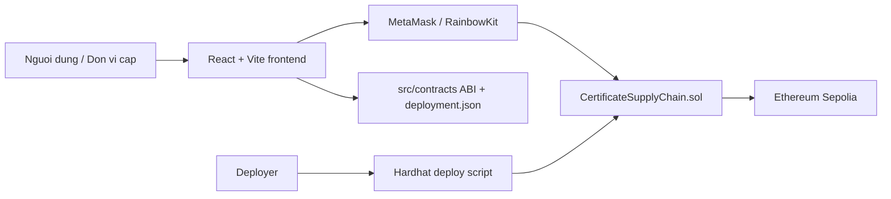
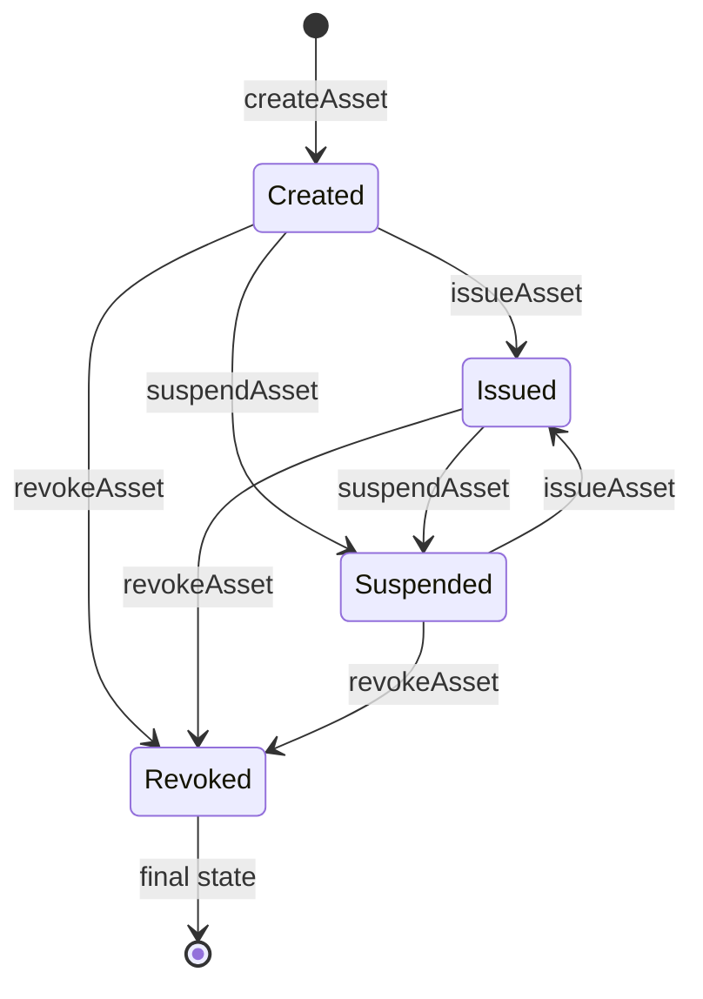
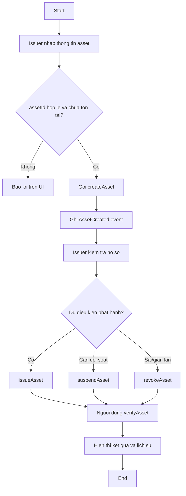

# Certificate Verification dApp - Backend Report

## 1. Muc tieu

Xay dung proof-of-concept dApp quan ly truy xuat nguon goc va chung nhan tren Ethereum testnet. He thong co the dung cho chung nhan bang cap, lo hang nong san, duoc pham hoac tai san can theo doi trang thai minh bach.

Trong ban demo nay, frontend dang tap trung vao bai toan chung nhan hoc tap. Backend duoc thiet ke tong quat voi ten `Asset` de co the mo rong sang ma lo hang hoac chung chi khac.

## 2. Kien truc tong quan



Thanh phan chinh:

- Smart contract: `contracts/CertificateSupplyChain.sol`
- Deploy script: `scripts/deploy.cjs`
- Test contract: `test/CertificateSupplyChain.test.ts`
- Frontend adapter: `src/contracts/certificateRegistry.ts`
- Deploy output: `src/contracts/deployment.json`

## 3. Mo hinh du lieu

`Asset` gom:

- `assetId`: ma chung nhan hoac ma lo hang, vi du `CERT-2026-001`
- `holderName`: nguoi nhan chung nhan hoac chu the lien quan
- `assetName`: ten khoa hoc, ten lo hang hoac ten chung chi
- `metadataURI`: lien ket metadata ngoai chuoi, co the la IPFS/HTTPS
- `issuedDate`: ngay cap hien thi tren UI
- `issuer`: dia chi vi tao tai san
- `status`: `Created`, `Issued`, `Suspended`, `Revoked`
- `createdAt`, `updatedAt`: thoi gian blockchain
- `exists`: co ton tai hay khong

`HistoryItem` ghi lai moi lan doi trang thai:

- `status`
- `actor`
- `note`
- `timestamp`

## 4. Role va phan quyen

Contract co cac role:

- `Admin`: quan ly role, mac dinh la deployer.
- `Issuer`: tao va cap nhat chung nhan/tai san.
- `Verifier`: role danh cho mo rong nghiep vu xac minh, hien tai frontend co the doc public view nen chua bat buoc dung.

Ham quan tri:

- `setRole(address account, Role role)`
- `transferOwnership(address newOwner)`

Ham nghiep vu:

- `createAsset(...)`
- `issueAsset(assetId, note)`
- `suspendAsset(assetId, note)`
- `revokeAsset(assetId, note)`
- `updateStatus(assetId, newStatus, note)`
- `verifyAsset(assetId)`
- `getAsset(assetId)`
- `getHistory(assetId)`

## 5. Luong nghiep vu



Quy tac:

- Chi `Issuer`, `Admin` hoac `Owner` duoc tao/cap nhat.
- `assetId` khong duoc rong va khong duoc trung.
- `Revoked` la trang thai ket thuc, khong the khoi phuc trong PoC.
- `verifyAsset` tra ve `valid = true` khi tai san ton tai va trang thai la `Issued`.

## 6. Use case

| Use case | Actor | Mo ta | Contract function |
| --- | --- | --- | --- |
| Tao chung nhan | Issuer | Nhap ma, nguoi nhan, khoa hoc, metadata, ngay cap | `createAsset` |
| Phat hanh | Issuer | Chuyen tu da tao sang hop le | `issueAsset` |
| Tam dung | Issuer | Tam khoa chung nhan de doi soat | `suspendAsset` |
| Thu hoi | Issuer | Vo hieu hoa vinh vien | `revokeAsset` |
| Xac thuc | Public user | Tra cuu trang thai bang ma chung nhan | `verifyAsset`, `getAsset` |
| Xem lich su | Public user | Xem cac lan thay doi trang thai | `getHistory` |
| Quan ly role | Admin | Cap quyen issuer/verifier | `setRole` |

## 7. BPMN don gian



## 8. Tich hop frontend

Frontend hien co dang co cac trang:

- `/create`: tao chung nhan
- `/update`: cap nhat trang thai
- `/verify`: tra cuu
- `/certificate/:id`: chi tiet

Backend cung cap adapter `src/contracts/certificateRegistry.ts`:

```ts
import { getCertificateRegistry } from "@/contracts/certificateRegistry";
import { useEthersSigner } from "@/lib/wagmi";

const signer = useEthersSigner();
const contract = signer ? getCertificateRegistry(signer) : undefined;
await contract?.createAsset(id, holderName, course, metadataURI, issuedDate);
await contract?.issueAsset(id, "Issued by school admin");
```

Sau khi deploy, `scripts/deploy.cjs` tu dong ghi:

- `src/contracts/deployment.json`
- `src/contracts/CertificateSupplyChain.abi.json`

## 9. DevOps nhe va demo

Chuan bi `.env`:

```bash
cp .env.example .env
```

Dien:

```bash
SEPOLIA_RPC_URL=https://sepolia.infura.io/v3/YOUR_PROJECT_ID
PRIVATE_KEY=YOUR_DEPLOYER_PRIVATE_KEY_WITHOUT_0X
ETHERSCAN_API_KEY=YOUR_ETHERSCAN_API_KEY
```

Lenh can dung:

```bash
npm install
npm run compile
npm run test:contract
npm run deploy:sepolia
npm run dev
```

Luu y gas:

- Sepolia can ETH testnet trong vi deployer.
- Moi lan tao/cap nhat asset la mot transaction ghi state nen ton gas.
- Cac ham `verifyAsset`, `getAsset`, `getHistory` la `view`, frontend doc mien phi neu goi qua RPC.

## 10. Phan tich bao mat

Diem da xu ly:

- Role-based access control cho ham tao/cap nhat.
- Khong cho trung `assetId`.
- Khong cho cap nhat sau khi da `Revoked`.
- Event log day du cho tao va thay doi trang thai.
- Khong luu file bang/chung nhan truc tiep on-chain, chi luu metadata URI de giam gas.

Rui ro con lai:

- `metadataURI` la chuoi tu do, chua co checksum noi dung.
- Admin/deployer la diem tap trung quyen luc.
- Chua co multi-signature cho thao tac thu hoi.
- Chua co oracle/off-chain verifier cho thong tin ngoai doi.
- Frontend can kiem tra dung chainId Sepolia va contract address khac zero truoc khi goi transaction.

## 11. Han che va future work

Han che:

- PoC chi quan ly mot contract registry, chua co indexer rieng.
- Chua co upload IPFS tu frontend.
- Chua co dashboard quan tri role day du.
- Chua co phan batch import nhieu chung nhan.

Huong phat trien:

- Them IPFS upload va hash file PDF.
- Them EIP-712 signature de issuer ky metadata off-chain.
- Them multi-sig hoac timelock cho `revokeAsset`.
- Xay indexer bang The Graph hoac backend Node.js de loc event nhanh.
- Mo rong sang supply chain voi cac role Producer, Distributor, Retailer, Inspector.
